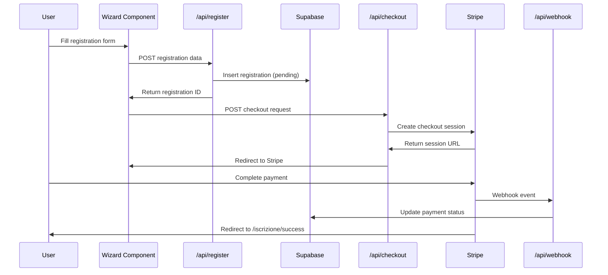
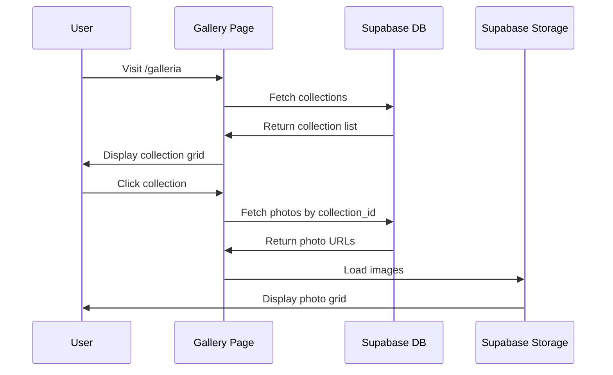

# Mini & Basket Camp - Architecture Documentation

## Overview

This document describes the architecture of the Mini & Basket Camp website, a Next.js 14 application using the App Router with TypeScript, Tailwind CSS, Supabase, and Stripe.

---

## Table of Contents

1. [Tech Stack](#tech-stack)
2. [Project Structure](#project-structure)
3. [Key Components](#key-components)
4. [API Routes](#api-routes)
5. [Data Flow](#data-flow)
6. [Authentication](#authentication)
7. [Payment Flow](#payment-flow)
8. [Gallery System](#gallery-system)

---

## Tech Stack

| Layer | Technology | Purpose |
|-------|-----------|---------|
| **Frontend** | Next.js 14 (App Router) | React framework with SSR/SSG |
| **Language** | TypeScript | Type-safe JavaScript |
| **Styling** | Tailwind CSS | Utility-first CSS |
| **Database** | Supabase (PostgreSQL) | Backend-as-a-service |
| **Payments** | Stripe Checkout | Payment processing |
| **Storage** | Supabase Storage | Image hosting for gallery |
| **Hosting** | Vercel | Serverless deployment |

---

## Project Structure

```
c:\Miniandbascketcamp\
├── docs/                           # Documentation
│   ├── ARCHITECTURE.md            # This file
│   ├── DATABASE_DESIGN.md         # Schema documentation
│   ├── STRIPE_SETUP.md            # Payment setup guide
│   ├── VERCEL_SETUP.md            # Deployment guide
│   └── SUPABASE_NETLIFY_SETUP.md  # Database setup
│
├── public/                         # Static assets
│   ├── images/                    # Public images
│   │   ├── staff/                 # Trainer photos
│   │   ├── partners/              # Partner logos
│   │   └── sponsors/              # Sponsor logos
│   └── manifest.json              # PWA manifest
│
├── scripts/                        # Utility scripts
│   └── upload-gallery.mjs         # Gallery upload script
│
├── src/
│   ├── app/                       # Next.js App Router
│   │   ├── layout.tsx             # Root layout
│   │   ├── page.tsx               # Homepage
│   │   ├── globals.css            # Global styles
│   │   ├── robots.ts              # SEO robots
│   │   ├── sitemap.ts             # SEO sitemap
│   │   │
│   │   ├── admin/                 # Admin panel
│   │   │   ├── layout.tsx         # Admin layout with sidebar
│   │   │   ├── page.tsx           # Admin login
│   │   │   ├── dashboard/         # Statistics dashboard
│   │   │   ├── iscrizioni/        # Registration management
│   │   │   └── galleria/          # Gallery management
│   │   │
│   │   ├── api/                   # API routes
│   │   │   ├── register/          # Registration endpoint
│   │   │   ├── checkout/          # Stripe checkout creation
│   │   │   ├── webhook/           # Stripe webhook handler
│   │   │   └── admin/             # Admin API endpoints
│   │   │       ├── registrations/ # Get/manage registrations
│   │   │       └── stats/         # Dashboard statistics
│   │   │
│   │   ├── contatti/              # Contact page
│   │   ├── faq/                   # FAQ page
│   │   ├── galleria/              # Gallery pages
│   │   │   ├── page.tsx           # Collections grid
│   │   │   └── [slug]/            # Collection detail
│   │   ├── iscrizione/            # Registration
│   │   │   ├── page.tsx           # Registration wizard
│   │   │   └── success/           # Payment success
│   │   ├── privacy/               # Privacy policy
│   │   ├── programma/             # Program details
│   │   ├── regolamento/           # Camp rules
│   │   ├── staff/                 # Staff page
│   │   └── test-payment/          # Payment testing (dev)
│   │
│   ├── components/                # React components
│   │   ├── admin/                 # Admin components
│   │   │   ├── AdminHeader.tsx
│   │   │   ├── AdminSidebar.tsx
│   │   │   ├── GalleryManager.tsx
│   │   │   ├── PhotoUploader.tsx
│   │   │   ├── RegistrationDetail.tsx
│   │   │   ├── RegistrationsTable.tsx
│   │   │   └── StatsCard.tsx
│   │   │
│   │   ├── Accordion.tsx          # FAQ accordion
│   │   ├── BasketballShotAnimation.tsx
│   │   ├── ContactForm.tsx        # Contact form
│   │   ├── CookieConsent.tsx      # GDPR cookie banner
│   │   ├── DecorativeElements.tsx
│   │   ├── ExperienceSection.tsx
│   │   ├── FacilitiesGrid.tsx
│   │   ├── FinalCTA.tsx           # Call-to-action section
│   │   ├── Footer.tsx             # Site footer
│   │   ├── GalleryPreview.tsx     # Homepage gallery
│   │   ├── Hero.tsx               # Homepage hero
│   │   ├── InfoBar.tsx            # Date/location bar
│   │   ├── Navigation.tsx         # Site navigation
│   │   ├── PageHero.tsx           # Page headers
│   │   ├── PartnersGrid.tsx       # Partners section
│   │   ├── PaymentInfo.tsx        # Payment details
│   │   ├── PaymentMethods.tsx     # Payment options
│   │   ├── PricingCards.tsx       # Pricing display
│   │   ├── ProgramHighlights.tsx  # Program features
│   │   ├── RegistrationWizard.tsx # Multi-step form
│   │   ├── StaffPreview.tsx       # Staff section
│   │   ├── StripeCheckout.tsx     # Checkout component
│   │   └── TestimonialsCarousel.tsx
│   │
│   ├── lib/                       # Utilities
│   │   ├── auth.ts                # Authentication helpers
│   │   ├── calendar.ts            # Date utilities
│   │   ├── database.ts            # Database operations
│   │   ├── mockData.ts            # Demo mode data
│   │   ├── stripe.ts              # Stripe configuration
│   │   ├── supabase.ts            # Supabase clients
│   │   └── validation.ts          # Form validation
│   │
│   └── types/                     # TypeScript types
│       ├── gallery.ts             # Gallery types
│       └── registration.ts        # Registration types
│
├── supabase/                      # Database
│   ├── config.toml                # Local dev config
│   ├── seed.sql                   # Seed data
│   └── migrations/                # Schema migrations
│       ├── 20241210_initial_schema.sql
│       ├── 20241211_storage_buckets.sql
│       └── 20241213_gallery_collections.sql
│
├── .env.local.example             # Environment template
├── next.config.mjs                # Next.js config
├── tailwind.config.ts             # Tailwind config
├── tsconfig.json                  # TypeScript config
└── package.json                   # Dependencies
```

---

## Key Components

### Homepage Components

| Component | Path | Description |
|-----------|------|-------------|
| `Hero` | [`src/components/Hero.tsx`](../src/components/Hero.tsx) | Full-screen hero with CTA |
| `InfoBar` | [`src/components/InfoBar.tsx`](../src/components/InfoBar.tsx) | Camp dates and location |
| `PricingCards` | [`src/components/PricingCards.tsx`](../src/components/PricingCards.tsx) | Package pricing display |
| `StaffPreview` | [`src/components/StaffPreview.tsx`](../src/components/StaffPreview.tsx) | Featured trainers |
| `GalleryPreview` | [`src/components/GalleryPreview.tsx`](../src/components/GalleryPreview.tsx) | Photo highlights |
| `FinalCTA` | [`src/components/FinalCTA.tsx`](../src/components/FinalCTA.tsx) | Registration call-to-action |

### Registration System

| Component | Path | Description |
|-----------|------|-------------|
| `RegistrationWizard` | [`src/components/RegistrationWizard.tsx`](../src/components/RegistrationWizard.tsx) | 8-step registration form |
| `StripeCheckout` | [`src/components/StripeCheckout.tsx`](../src/components/StripeCheckout.tsx) | Stripe payment integration |
| `PaymentMethods` | [`src/components/PaymentMethods.tsx`](../src/components/PaymentMethods.tsx) | Payment method display |

### Admin Dashboard

| Component | Path | Description |
|-----------|------|-------------|
| `AdminSidebar` | [`src/components/admin/AdminSidebar.tsx`](../src/components/admin/AdminSidebar.tsx) | Navigation sidebar |
| `RegistrationsTable` | [`src/components/admin/RegistrationsTable.tsx`](../src/components/admin/RegistrationsTable.tsx) | Registration list with filters |
| `RegistrationDetail` | [`src/components/admin/RegistrationDetail.tsx`](../src/components/admin/RegistrationDetail.tsx) | Single registration view |
| `StatsCard` | [`src/components/admin/StatsCard.tsx`](../src/components/admin/StatsCard.tsx) | Dashboard statistics |
| `GalleryManager` | [`src/components/admin/GalleryManager.tsx`](../src/components/admin/GalleryManager.tsx) | Photo management |

---

## API Routes

### Public API

| Endpoint | Method | Description |
|----------|--------|-------------|
| `/api/register` | POST | Submit new registration |
| `/api/checkout` | POST | Create Stripe checkout session |
| `/api/webhook` | POST | Stripe webhook handler |

### Admin API

| Endpoint | Method | Description |
|----------|--------|-------------|
| `/api/admin/registrations` | GET | List all registrations |
| `/api/admin/registrations/[id]` | GET, PATCH | Single registration |
| `/api/admin/stats` | GET | Dashboard statistics |

### API Route Implementation

```typescript
// Example: /api/checkout/route.ts
export async function POST(request: Request) {
  const { registrationId, paymentType } = await request.json()
  
  // 1. Fetch registration from Supabase
  // 2. Calculate price based on package and early bird
  // 3. Create Stripe checkout session
  // 4. Return session URL
}
```

---

## Data Flow

### Registration Flow



### Gallery Data Flow



---

## Authentication

### Admin Authentication

The admin panel uses a simple email/password authentication:

```typescript
// src/lib/auth.ts
export function validateCredentials(email: string, password: string): boolean {
  // Demo mode
  if (email === 'Demo@demo.com' && password === 'demo123') {
    return true
  }
  
  // Production: validate against Supabase Auth
  const { data, error } = await supabase.auth.signInWithPassword({
    email,
    password
  })
  
  return !error && data.user
}
```

### Session Management

- Demo mode: Session stored in localStorage
- Production: Supabase Auth session with JWT

---

## Payment Flow

### Stripe Integration

```
┌─────────────────────────────────────────────────────────────┐
│                    PAYMENT FLOW                             │
├─────────────────────────────────────────────────────────────┤
│                                                             │
│  1. User completes registration form                        │
│     └── RegistrationWizard.tsx                             │
│                                                             │
│  2. Registration saved to Supabase (status: pending)        │
│     └── /api/register                                       │
│                                                             │
│  3. User selects payment type (full/deposit)                │
│     └── StripeCheckout.tsx                                  │
│                                                             │
│  4. Checkout session created                                │
│     └── /api/checkout                                       │
│     └── Uses stripe.checkout.sessions.create()              │
│                                                             │
│  5. User redirected to Stripe Checkout                      │
│     └── Hosted payment page                                 │
│     └── 6 payment methods available                         │
│                                                             │
│  6. Payment completed                                       │
│     └── Stripe sends webhook                                │
│     └── /api/webhook receives event                         │
│                                                             │
│  7. Database updated                                        │
│     └── registration.payment_status = 'paid'                │
│     └── registration.status = 'confirmed'                   │
│                                                             │
│  8. User redirected to success page                         │
│     └── /iscrizione/success                                 │
│                                                             │
└─────────────────────────────────────────────────────────────┘
```

### Pricing Configuration

```typescript
// src/lib/stripe.ts
export const PRICES = {
  standard: {
    full: 61000,      // €610 in cents
    earlyBird: 59000, // €590 in cents
    deposit: 10000    // €100 deposit
  },
  alta_specializzazione: {
    full: 80000,      // €800 in cents
    earlyBird: 76000, // €760 in cents
    deposit: 10000    // €100 deposit
  }
}

export const EARLY_BIRD_DEADLINE = new Date('2026-02-28')
```

---

## Gallery System

### Storage Architecture

```
Supabase Storage
└── gallery/                    # Public bucket for camp photos
    ├── camp-2024/
    │   ├── photo-001.jpg
    │   ├── photo-002.jpg
    │   └── ...
    ├── camp-2023/
    │   └── ...
    └── one-day-camp-2024/
        └── ...
```

**Note:** The `gallery` bucket must be public. If images aren't loading, verify in Supabase Dashboard:
1. Go to Storage → gallery bucket
2. Click on bucket settings
3. Ensure "Public bucket" is enabled
4. Check that RLS policies exist for SELECT on `storage.objects`

### Gallery Database Schema

```sql
-- Collections organize photos
gallery_collections
├── id (UUID)
├── name ("Camp 2024")
├── slug ("camp-2024")
├── collection_type (camp, one_day_camp, event)
├── year (2024)
└── cover_image_url

-- Photos belong to collections
gallery_photos
├── id (UUID)
├── collection_id (FK → gallery_collections)
├── url (Supabase Storage URL)
├── storage_path (gallery-photos/camp-2024/photo-001.jpg)
├── alt_text
└── sort_order
```

### Upload Script

```bash
# Upload photos from local folder
npm run upload-gallery

# Script: scripts/upload-gallery.mjs
# 1. Reads images from local folder
# 2. Uploads to Supabase Storage
# 3. Creates database entries
# 4. Links to collection
```

---

## Environment Variables

| Variable | Required | Description |
|----------|----------|-------------|
| `NEXT_PUBLIC_SUPABASE_URL` | Yes | Supabase project URL |
| `NEXT_PUBLIC_SUPABASE_ANON_KEY` | Yes | Supabase anonymous key |
| `SUPABASE_SERVICE_ROLE_KEY` | Yes | Supabase service role key (server only) |
| `NEXT_PUBLIC_STRIPE_PUBLISHABLE_KEY` | Yes | Stripe publishable key |
| `STRIPE_SECRET_KEY` | Yes | Stripe secret key (server only) |
| `STRIPE_WEBHOOK_SECRET` | Yes | Stripe webhook signing secret |

---

## Performance Considerations

### Next.js Optimizations

- **Image Optimization**: Using `next/image` for automatic optimization
- **Route Segments**: Using App Router for better code splitting
- **Static Generation**: Pages without dynamic data are pre-rendered
- **Server Components**: Default for reduced client bundle

### Database Optimizations

- **Indexes**: Configured for common query patterns
- **RLS Policies**: Row-level security for data protection
- **Connection Pooling**: Supabase handles connection management

### Caching Strategy

- **Static Assets**: Cached by Vercel CDN
- **Gallery Images**: Cached by Supabase Storage CDN
- **API Responses**: Use Next.js caching where appropriate

---

## Security

### Data Protection

- HTTPS enforced in production
- Supabase RLS policies protect data access
- Service role key never exposed to client
- Stripe webhook signature verification

### Input Validation

```typescript
// src/lib/validation.ts
export function validateRegistration(data: RegistrationData): ValidationResult {
  // Validate required fields
  // Validate email format
  // Validate fiscal code format (Italian Codice Fiscale)
  // Validate phone number
  // Return errors or success
}
```

---

## Future Improvements

- [ ] Email notifications for registrations
- [ ] PDF generation for confirmation letters
- [ ] Multi-language support (IT/EN)
- [ ] Progressive Web App (PWA) features
- [ ] Advanced analytics dashboard
- [ ] Automated backup system

---

## Related Documentation

- [Database Design](DATABASE_DESIGN.md)
- [Stripe Setup](STRIPE_SETUP.md)
- [Vercel Deployment](VERCEL_SETUP.md)
- [Supabase Setup](SUPABASE_NETLIFY_SETUP.md)